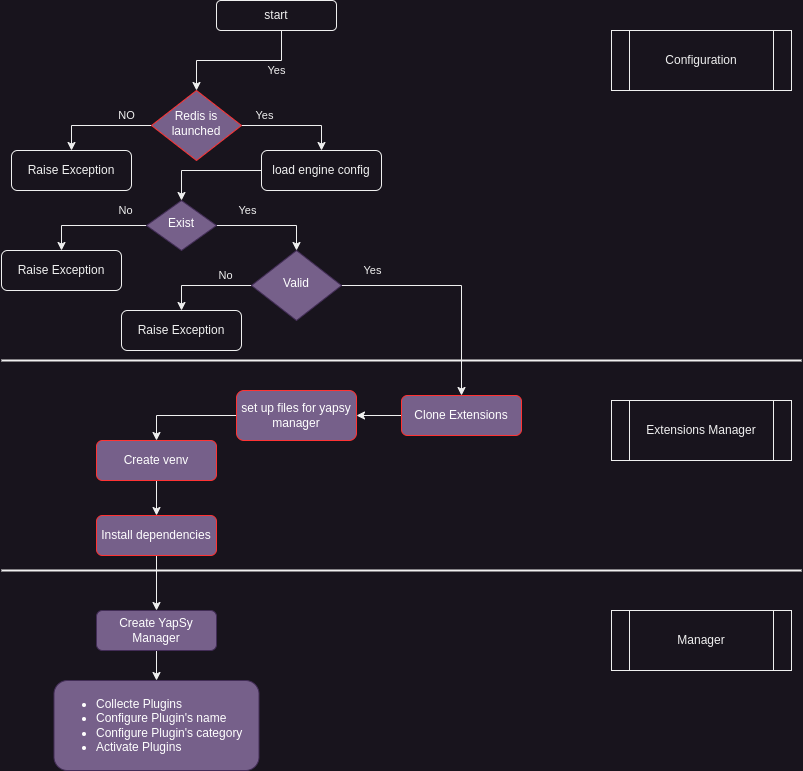
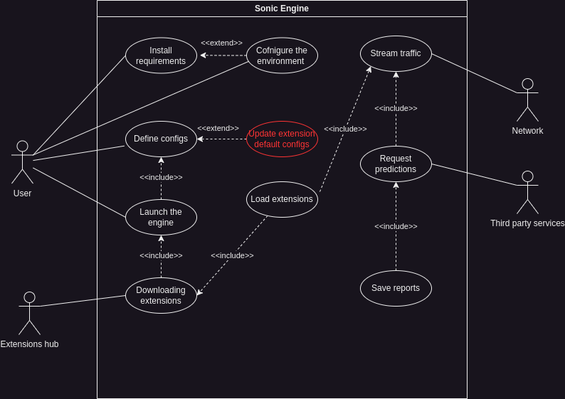
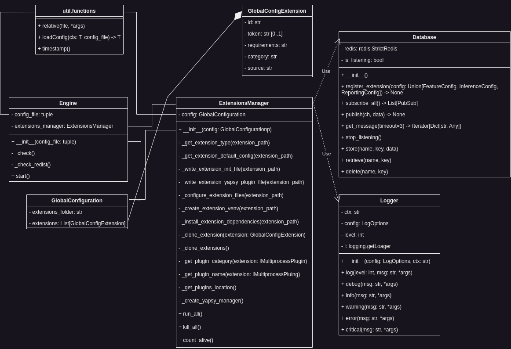

<h1 align="center"> 
Sonic Engine v2.2.8
</h1>

## Table of Contents

- [Introduction](#introduction)
- [Installation](#installation)
- [Workflow](#workflow)
- [Extensions](#extensions-in-sonic-engine)
- [Extensions API](#extensions-api)
- [Config File](#config-file)

  - [Override Field](#override-field)

- [Hello World Template](#hello-world-template)
- [Contributing](#contributing)
- [FAQ](#faq)
- [UML Diagrams](#uml-diagrams)

  - [Use Case Diagram](#use-case-diagram)
  - [Class Diagram](#class-diagram)
  - [Sequence Diagram](#sequence-diagram)

- [Docker](#docker)

  - [Redis](#redis)
  - [Engine](#engine)

## Introduction

Stream Processing and Reporting Extensions Manager for Network Traffic Analysis

Sonic Engine serves as a powerful `plugin manager` designed for stream processing and reporting. It is implemented as a Python package, facilitating the loading of a specific set of plugins categorized for different tasks, and efficiently coordinating the communication between these plugins.

## Installation

_(Comming soon as a CLI tool)_, for now you can jump to the [Hello World Template](#hello-world-template) section to get started with a ready to use template.

## Workflow



## Extensions in Sonic Engine

In Sonic Engine, extensions play a vital role in enabling the core functionality by being dynamically loaded as plugins.

### Extensions Categories

The extensions in Sonic Engine are categorized into three distinct groups, as specified in the `config.yaml` file:

### 1. Features

Features represent the first category of extensions and are primarily responsible for efficiently streaming the network traffic. These extensions source their input from `pcap` files or directly from the network interface. Once the input is processed, they publish the resulting output to a designated channel in the `redis` message broker. This enables seamless communication and data flow between the Features extensions and the Engine.

### 2. Inference

Inference extensions make up the second category and are crucial for detecting potentially malicious network traffic. They achieve this by employing various techniques such as making API requests to external services or leveraging machine learning models to analyze and identify suspicious patterns. Inference extensions subscribe to the output generated by specific Feature extensions. After processing the received data, they publish their own output to a designated channel in the `redis` database. This interaction between Inference extensions and other components allows for effective detection and analysis of potential threats.

### 3. Reporting

The third category of extensions, Reporting, holds the responsibility of logging the output generated by the Inference extensions. They are tasked with writing this information to designated files or databases, making it accessible for further analysis or auditing. Reporting extensions subscribe to the output of specific Inference extensions, enabling them to capture relevant data and facilitate proper reporting and documentation of potential security events.

By dividing extensions into these three distinct categories, Sonic Engine efficiently organizes and facilitates the flow of information, enabling seamless collaboration between various components, and enhancing the overall effectiveness of the stream processing and reporting functionalities.

## Extensions API

The Extensions API sets the guidelines and requirements that extensions must follow to seamlessly integrate with Sonic Engine. By adhering to this API, extensions ensure proper functioning within the system and contribute to the overall efficiency and performance of the Sonic Engine.

### Extension Config File

```yaml
%YAML 1.2
---
##
## Metadata: Shared configuration for all extensions
##

id: hello_world_extension
# unique id for each extension, gonna be used as the extension directory name
name: Hello World Extension
description: This is a hello world extension
version: 1.0.0
authors: Ahmed Bargady <https://github.com/AhmedCoolProjects>
license: BSD
repository:
# can be empty, Not used for this current version

requirements: requirements.txt
# define the requirements file for the extension

log:
  # defines the location and the level of your extension logs
  dir: ./logs
  level: INFO
##
## Channels: Depending on the extension category, you have to define the channels that your extension gonna use to communicate with other extensions
##

## ------------------- For feature extensions

channels:
  # define the input sources and publishing redis channels
  input:
    files: [./pcap/2022-11-17-Bumblebee-infection-traffic.pcap]
    interfaces: []
  publish: [helloWorldFeatureExtensionChannel]
## ------------------- For inference extensions

# channels:
# # define the subscribing and publishing redis channels
#  subscribe: [helloWorldFeatureExtensionChannel]
#  publish: [helloWorldInferenceExtensionChannel]

## ------------------- For reporting extensions

# channels:
# # define the subscribing redis channels
#  subscribe: [helloWorldInferenceExtensionChannel]
```

### How it works?

The Sonic Engine extensions configs are **no more** loaded by the extension itself. Instead, we are taking advantage of the `IMultiprocessPlugin` object by **Yapsy** to load the extension configs _by the engine_ and pass it to the extension as a parameter in the `P.recv()` method.

```python
def __init__(self, p):
    IMultiprocessPlugin.__init__(self, p)

    data = p.recv()
    config = data['config']
    message = data['message']

    self.config = config
    print(f"{message}")
```

This way gonna make it easier for us later on to have a full control on duplicating as many instances of the extension as we want.

## Config File

This is the `config.yaml` file being used by the your engine instance to define your metadata and load your extensions.

You can find the config data model under the `sonic_engine/model/global_.py` file.

### Override Field

For any single extension, you can add an override field that provides a list of fields to override in the default configs of the extension. You can find the possible fields within the `sonic_engine/model/global_.py` file.

#### The loadConfig function

This function is responsible for loading the `config.yaml` files, validate them and override them in case of any override field is provided.

Possible cases:

- **No override provided**: load the default configs only for one instance of the extension.
- **Override provided with no `id` field**: redefine the default configs for the default instance of the extension.
- **Override provided with `id` field**: load the default configs for the default instance of the extension and create a new duplicated instance of the extension with the provided `id` and other fields.

Steps:

1. Load the default configs with the override list if provided
2. Redefine the default configs _(for the default instance of the extension)_ if there is an override item with no `id` field.
3. Consider all items within the override list with `id` field as a new duplicated instance of the extension with different configs.
4. Install the default extension instance with its duplicated instances.

## Hello World Template

A minimal template to test the **sonic engine** with read to use _hello world extensions_.

### Hello World Extensions

| Extension Name                  | Category  | Description                                                                                                                                                  | Github repo                                                                         |
| ------------------------------- | --------- | ------------------------------------------------------------------------------------------------------------------------------------------------------------ | ----------------------------------------------------------------------------------- |
| Hello World Feature Extension   | feature   | Simple extension that extract the _source ip_ and _destination ip_ addresses from the pcap files.                                                            | [Check It](https://github.com/AhmedCoolProjects/sonic-engine-hello-world-feature)   |
| Hello World Inference Extension | inference | Sending the extracted _source ip address_ in a request to the [VirusTotal API](https://developers.virustotal.com/reference/overview) to get a JOSN response. | [Check It](https://github.com/AhmedCoolProjects/sonic-engine-hello-world-inference) |
| Hello World Reporting Extension | reporting | Write the Sent ip address and VirusTotal response to a text log file.                                                                                        | [Check It](https://github.com/AhmedCoolProjects/sonic-engine-hello-world-reporting) |

## Contributing

## FAQ

## UML Diagrams

### Use Case Diagram



### Class Diagram



### Sequence Diagram


## Docker

### Redis

In the `redis` directory, you can find a `Dockerfile` and a `docker-compose.yaml` file to build and run a `redis` container.

Note: add a `.env` file in the `redis` directory with the following content:

```bash
COMPOSE_PROJECT_NAME=sonic
```

This will be used as the project name for the `docker-compose` command.

To build and run the `redis` container, run the following command:

```bash
docker-compose up
```

### Engine

Open another terminal and navigate to the root directory of the project, then add a `.env` file with the following content:

```bash
COMPOSE_PROJECT_NAME=sonic
```

Then run the following command to build the sonic engine image from `Dockerfile` and run a container from it:

```bash
docker-compose up
```

This container gonna install the `sonic-engine` package in it, then clone a `hello world` template from [Sonic Engine templates repo](https://github.com/AhmedCoolProjects/sonic_engine_templates) and run it.

<!-- NOTES -->

- create a separate class for extension instances

```
sonic-engine
├─ .dockerignore
├─ .gitignore
├─ assets[...]
├─ docker-compose.yaml
├─ Dockerfile
├─ README.md
├─ redis[...]
├─ requirements-tests.txt
├─ requirements.txt
├─ setup.py
├─ sonic_engine
│  ├─ core
│  │  ├─ database.py
│  │  ├─ engine.py (docs, )
│  │  ├─ extensions.py (docs,)
│  │  ├─ extension.py (docs, )
│  │  ├─ extension_instance.py
│  │  ├─ logger.py
│  │  ├─ server.py
│  │  ├─ yapsy_methods.py
│  │  └─ __init__.py
│  ├─ model
│  │  ├─ app_config.py
│  │  ├─ extension.py
│  │  ├─ log.py
│  │  └─ __init__.py
│  ├─ util
│  │  ├─ dataclass.py
│  │  ├─ functions.py
│  │  └─ __init__.py
│  └─ __init__.py
├─ tests[...]
├─ __init__.py
└─ __main__.py
```
