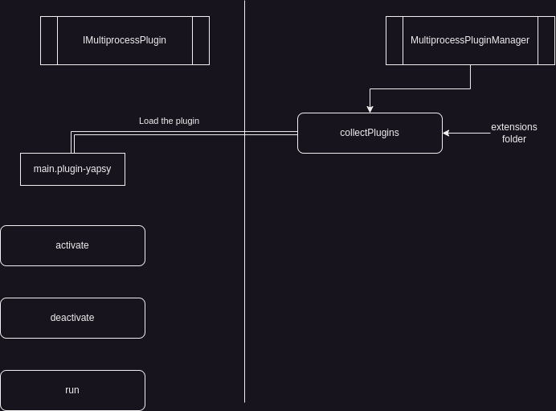

<h1 align="center"> 
YapSy Mini Documentation
</h1>

## MultiprocessPluginManager

```py
from yapsy.MultiprocessPluginManager import MultiprocessPluginManager
```

Defines a plugin manager that runs all plugins in `separate process` linked by pipes.

### BuiltIn methods

- collectPlugins()
- activatePluginByName()
- getPluginByName()

## IMultiprocessPlugin 

```py
from yapsy.IMultiprocessPlugin import IMultiprocessPlugin
```

### BuiltIn methods

- activate()
- deactivate()
- run()

## Workflow


